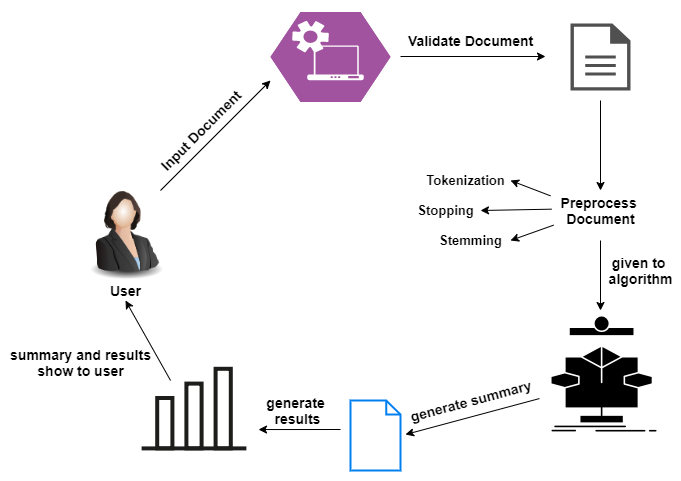

# Text Summarizer

Text summarizer is web-application to generate summary from user given text data. It is developed in python using django framework and it is combination of Natural Language Processing (NLP) and Full-stack development. It contains various REST APIs for authentication, summary generation, feedback, etc.

## Technologies
* **Backend**: Python, Django
* **Frontend**: HTML, CSS, JavaScript, JQuery, Bootstrap, Jinja
* **NLP**: spaCy
* **DB**: SQLite

## Workflow of Summarization Algorithm

It works based on word frequency count where spaCy library is used for NLP ("summarizersite\firstapp\module.py").

## APIs

* **login_request**: User can sign in to existing account using email id and password
* **register**: User can create new account
* **forgotpassword**: Supports user with forgotten password
* **summarizer**: User can generate summary by writing the text data in the text box or by uploading PDF of textual data. The generated summary will appear in the text box below or user can download it in the form of pdf.
* **index**: Opens the homepage of the webside upon signing in
* **contact**: User can reach out by sending message
* **about**: Gives information about the website
* **feedback**: User can give rating and review 
* **subscribe**: User can subscribe using their email
* **logout_request**: log out user and end the current session

## Front-end Documentation

Front-end provides the following functionalities:

* User Registration and Login
* Text Summarization
* Feedback Submission
* Contact Us Form
* About Us Page
* Subscription Services